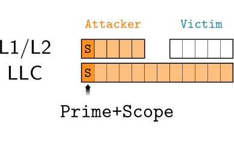

# Getting Started with Prime+Scope

This app features a quick and simple demonstration of Prime+Scope, as well as the necessary "PS-style" eviction set construction.

     

## Description

The app contains two tests: 

1. Prime+Scope 
   
    We have mainly two threads: the `attacker` thread uses Prime+Scope for detecting the accesses of a `victim` thread to target memory address.

    In this PoC, the `attacker` uses a `attacker_helper` thread, but only for limited purposes:

    -  For inclusive Intel caches, it is only used for convenient threshold calibration 
    -  For non-inclusive Intel caches, it is used for convenient threshold calibration, as well as the eviction set construction.

    The helper thread is killed when it is no longer needed.

    For a successful use of Prime+Scope, you will need an eviction set for the LLC (inclusive Intel caches) or the CD (non-inclusive Intel caches). For this, the code uses the eviction set construction code in [evsets](../evsets), as described in Section 6.5 of the paper. If you are unable to construct an eviction set on your platform, this should be addressed first. For this, the following test may be interesting.

2. Eviction Set Construction

    The `attacker` thread continuously constructs eviction sets, and prints some statistical information about how successful it is.

    The `victim` thread is not used in this test case.

## Configuration

Starting with `configuration.h` is essential. You must input the cache information of the target machine correctly, and set the execution parameters. To help users, the `configuration.h` file is commented thorougly.

While editing `configuration.h`, **pay special attention to the following parameters:**

1. `{ATTACKER,HELPER,VICTIM}_CORE`

    Core affinities of the threads.  In case of a hyperthreaded machine, logical siblings can be learned, e.g., through: `cat /sys/devices/system/cpu/cpu0/topology/thread_siblings_list`

2. `HUGE_PAGES_AVAILABLE`

    If hugepages are available on the machine, indicate it. All PoCs in this repository should work with small pages too (hence, this is the default setting), but enabling huge pages may increase robustness on your system.

3. `PLATFORM`
    
    If you are in luck, then Table 1 features your Intel CPU (or a related one), and you will be able to use a predefined PRIME pattern. These patterns were obtained with the [PrimeTime](../primetime) tool and can be found in [prime.h](./prime.h). The correct `PRIME()` definition is then selected based on the defined platform macro (e.g., `KABYLAKE12`).

    If you expect a high noise level on the machine, you may want to increase the number of repetitions of the traversal patterns in the `PRIME()` definition.

    If the predefined patterns do not work (well) on your machine, you can use [PrimeTime](../primetime) to obtain one. Then, add it to [prime.h](./prime.h).
    If you decide to define a new platform, ensure that the following parameters are set correctly as well:

    - `LLC_INCLUSIVE`/`LLC_NONINCLUSIVE`
    - `LLC_WITH_..._WAY_..._SET`

## Execution

To execute the Prime+Scope test:

1. Compile with `make`
2. Run with `./app --primescope`

To execute the eviction set construction test, replace the last command with:

2. Run with `./app --evset`
