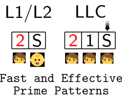

# PrimeTime is a Tool to Find Prime Access Patterns


To prepare the target cache set for the repeatable `scope` measurement, the `prime` operation accesses addresses from an eviction set using a specific access pattern.
This tool executes a search for efficient prime patterns for inclusive Intel LLCs. For a given platform, the pattern should reliably do the job while being as fast as possible. 
It has been tested on Intel CPUs released since 2011.

<p align="center">
     
</p>

## How to Use Primetime?

### Configuration Files

As the preparation step, the configuration files should be updated with the  cache information of the target machine. There are two files for this purpose:

1. `primeapp/configuration.h` 
How to configure this file should be self-explanatory.

2. `primebot/params.py`
The essential parameter in this file is `LLC_WAYS`, reflecting the cache 
associativity of the target machine's LLC.

### Execution

The file to execute `PrimeTime` is `execute_PS.sh`, besides its content is the
way to control the execution. It is a bash script to execute a set of 
operations, each requiring several operands. These operations will allow it to 
create an initial set of `prime` patterns, measure their performance, and 
filter well-performing ones. The list of available operations and the operands 
they expect are explained on the top of the file. Depending on the requested 
operations, the execution can take a few hours. Once the execution is finished, 
the `log/sorted.txt` file is created, which list the best performing patterns. 
In addition, the C implementation of these patterns can be found in 
`primeapp/prime.c`, which were used for measurements.

This `log/sorted.txt` file provides a sorted list of the found prime patterns, 
and has the following structure:

```
B504_PR302_S2          2 100.0 100.0 [1523, 1564, 2406] 32100123
B504_S3                3 100.0  99.8 [1082, 1372, 2603] 0123
```

* The first column refers to the name of the pattern. The corresponding pattern 
can be found in the `primeapp/prime.c` file, with the same name.
* The next column is for how many iterations are used. If is is, e.g., 2, the prime function should be executed twice to obtaining the given result.
* The next two columns are respectively for EV and EVC rates. The former 
indicates how successfull the pattern is for eviction, the latter indicates how 
successful it is for setting the eviction candidate in the LLC, while keeping it in L1.
  - The former property is relevant for a `Prime+Probe` attack, while the latter property defines the success of a `Prime+Scope` attack.
* The three next columns list the execution times of the corresponding 
accesses, respectively for fast, median, and slow executions.
* The last column is for the encoding of the corresponding access pattern in 
text.

## How does PrimeTime work?

Two main components of `PrimeTime` are the `primebot` and `primeapp`. 
In short, the former is a python script for generating prime access patterns, 
the latter is for measuring their effectiveness. After the measurements, the 
former is used again to filter the results. We describe these three steps 
below in more detail.

### PrimeBot Access Pattern Generation

The `createPrimes` operation in `execute_PS.sh` triggers the pattern 
generation of `primebot`. The operation expects two arguments; 
the first defines the creation type (explained below), the second is the file to which the list of created patterns will be written.

Currently, two creation types are supported, namely `var0` and `var1`. The former creates a large initial set, the latter a small one. The corresponding creation functions are `var0_Primes()` and `var1_Primes()` in `primebot/main.py`. To help users understand how these functions generate patterns, [`var0_Primes()` function](./primebot/main.py) is annotated with detailed comments.

### PrimeApp Access Pattern Measurements

In response to the `execution` operation in `execute_PS.sh`, first the patterns from a given log file (could be created by the above or below routine) are converted into a C code implementation. This code is the `primeapp/prime.c` file, having a separate function for each pattern. 

- Important: depending on the number of iterations in `execution`, the required stack size for the generated C program may exceed the defaults on your system (leading to a termination with segmentation fault.)
Therefore, we recommend to increase the stack size, e.g., as `ulimit -s unlimited`.


For example, the access pattern `01b23` may be converted into C as follows (see also Figure 4 in the paper).
The function receives a pointer to an array that contains the eviction set, and performs accesses over it.

```
void traverse_B504_E0002_S1(uint64_t* arr) {
  int i;
  for(i=0; i<9; i+=1) {
    maccess((void *) arr[i+0]);
    maccess((void *) arr[i+1]);
    maccess((void *) arr[  0]);
    maccess((void *) arr[i+2]);
    maccess((void *) arr[i+3]);
  }
}
```

The second step of the `execution` operation compiles the `primeapp` with the updated `prime.c` file contents and runs it. It checks whether the first element of the eviction set array could be set as the eviction 
candidate after calling each access pattern function. For each pattern, it performs this check for a given number of times, indicated by an operand to the `execution` operation. In addition, it writes the measurement results to a given output file, again indicated by an operand.

### PrimeBot Evaluating the Measurements

This step analyses the log file created by the execution and 
filters the best performing patterns by their effectiveness of setting the eviction candidate correctly or by the execution time of doing it. The output file can be used as an input file for a new `execution` command (described above) for iteratively searching for best performing patterns. Indeed the iterative execution can be observed in the `execute_PS.sh` file.

___


## PrimeTime for Prime+Probe

For `Prime+Probe`, an additional `execute_PP.sh` is provided. In this case, high EV rate is needed, while EVC rate is unimportant. As it does not require a high EVC rate, it works with loose constraints, so it finds the prime patterns in shorter time.